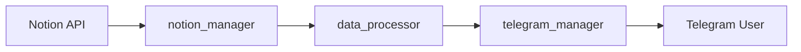

# Notion Telegram Bot

Bot de automação que integra o Notion com o Telegram, enviando atualizações sobre sprints e tarefas diretamente para seu chat.

## Sobre o Projeto

Este bot automatiza o acompanhamento de tarefas e sprints do Notion, enviando relatórios formatados via Telegram. Ideal para desenvolvedores e equipes que utilizam o Notion para gestão de projetos e querem receber notificações personalizadas.

## Funcionalidades Atuais

- **Sincronização com Notion**: Conecta-se à API do Notion para buscar dados de databases
- **Status de Sprints**: Busca e processa informações de sprints em andamento
- **BI Backlog**: Monitora tarefas do backlog com diferentes status (To Do, Doing, Explain to someone, Overdue)
- **Notificações Telegram**: Envia mensagens formatadas em HTML com emojis e destaque visual
- **Processamento de Dados**: Organiza e formata dados usando Pandas
- **Logs Detalhados**: Sistema de logging para rastreamento de operações

## 🚀 Funcionalidades Futuras

### 📊 Dashboard de Tarefas
- **Visualização Completa**: Ver total de tarefas pendentes, em andamento e atrasadas
- **Estatísticas**: Somar tarefas por status e gerar relatório de situação
- **Análise de Progresso**: Identificar gargalos e tendências

### Alertas de Deadline
- **Notificações Proativas**: Enviar mensagens quando datas de encerramento estão próximas
- **Alertas Personalizados**: Configurar antecedência de notificação por tipo de tarefa
- **Lembretes Inteligentes**: Ajustar frequência baseada em urgência

### Monitoramento de Inatividade
- **Detecção de Estagnação**: Identificar tarefas sem atualização há muito tempo
- **Lembretes Automáticos**: Enviar mensagens após período configurável sem movimentação
- **Tracking de Progresso**: Alertar sobre tarefas paradas em status "Doing" por muito tempo

### Integração com IA
- **Mensagens Dinâmicas**: Usar IA (GPT/Claude) para gerar mensagens contextuais e personalizadas
- **Análise Inteligente**: Sugerir prioridades baseadas em deadlines e dependências
- **Resumos Automáticos**: Gerar insights sobre produtividade e padrões de trabalho

## Tecnologias Utilizadas

- **Python 3.x**
- **Requests**: Comunicação com APIs REST
- **Pandas**: Processamento e análise de dados
- **Python-dotenv**: Gerenciamento de variáveis de ambiente
- **Notion API**: Integração com databases do Notion
- **Telegram Bot API**: Envio de mensagens

## Instalação

1. **Clone o repositório**
```bash
git clone https://github.com/seu-usuario/notion_telegram_bot.git
cd notion_telegram_bot
```

2. **Crie um ambiente virtual**
```bash
python -m venv venv
```

3. **Ative o ambiente virtual**
```bash
# Windows
venv\Scripts\activate

# Linux/Mac
source venv/bin/activate
```

4. **Instale as dependências**
```bash
pip install -r requirements.txt
```

## Configuração

1. **Crie um arquivo `.env` na raiz do projeto**
```env
# Notion API
NOTION_TOKEN=seu_token_notion_aqui
NOTION_VERSION=2022-06-28

# Telegram Bot
TELEGRAM_BOT_TOKEN=seu_token_telegram_aqui
TELEGRAM_CHAT_ID=seu_chat_id_aqui
```

2. **Obtenha as credenciais necessárias**

### Notion API
- Acesse [Notion Developers](https://www.notion.so/my-integrations)
- Crie uma nova integração
- Copie o `Internal Integration Token`
- Compartilhe os databases desejados com a integração

### Telegram Bot
- Abra o Telegram e busque por [@BotFather](https://t.me/botfather)
- Envie `/newbot` e siga as instruções
- Copie o token do bot
- Para obter o `chat_id`, envie uma mensagem para o bot e acesse:
  ```
  https://api.telegram.org/bot<SEU_TOKEN>/getUpdates
  ```

## Como Usar

Execute o bot:
```bash
python src/main.py
```

O bot irá:
1. Conectar-se à API do Notion
2. Buscar dados das sprints em andamento
3. Processar informações do BI Backlog
4. Formatar mensagem com status e tarefas
5. Enviar notificação via Telegram

## Estrutura do Projeto

```
notion_telegram_bot/
│
├── src/
│   ├── main.py                # Ponto de entrada da aplicação
│   ├── notion_manager.py      # Gerenciamento da API do Notion
│   ├── telegram_manager.py    # Gerenciamento da API do Telegram
│   ├── data_processor.py      # Processamento e formatação de dados
│   └── utils.py               # Funções utilitárias e logging
│
├── requirements.txt           # Dependências do projeto
├── .env                       # Variáveis de ambiente (não versionado)
└── README.md                  # Documentação do projeto
```

## Workflow de Dados



1. **notion_manager**: Busca dados das databases do Notion
2. **data_processor**: Processa e formata os dados usando Pandas
3. **telegram_manager**: Envia mensagem formatada para o Telegram

## Exemplo de Mensagem

```
Olá, Matheus! Seu status do Notion chegou!

Sprint: Sprint 2024-Q1

BI Backlog Tasks:

Implementar Dashboard: Doing
Criar Relatório Mensal: To Do
Revisar Código: Doing
Documentar API: Explain to someone

Gerado automaticamente pelo seu script Python.
```

## 🤝 Contribuindo

Contribuições são bem-vindas! Sinta-se à vontade para:

1. Fazer fork do projeto
2. Criar uma branch para sua feature (`git checkout -b feature/AmazingFeature`)
3. Commit suas mudanças (`git commit -m 'Add some AmazingFeature'`)
4. Push para a branch (`git push origin feature/AmazingFeature`)
5. Abrir um Pull Request

## Roadmap

- [ ] Implementar dashboard de estatísticas de tarefas
- [ ] Adicionar sistema de alertas de deadline
- [ ] Criar monitoramento de inatividade
- [ ] Integrar IA para mensagens dinâmicas
- [ ] Adicionar testes unitários
- [ ] Implementar scheduler para execução automática
- [ ] Criar interface web para configuração
- [ ] Adicionar suporte a múltiplos usuários

## Licença

Este projeto está sob a licença MIT. Veja o arquivo `LICENSE` para mais detalhes.

---

Se este projeto foi útil para você, considere dar uma estrela!
